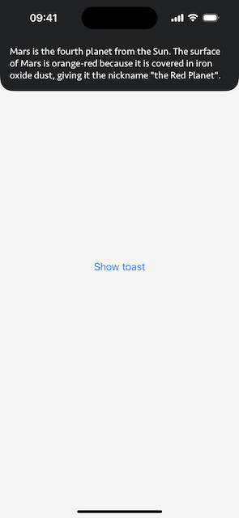

# Toast

[](https://github.com/apple/swift-package-manager)

🍞 Beautiful toast notifications with flexible view settings.

## Screenshots

 

## Installation

### [Swift Package Manager](https://swift.org/package-manager/)

Going to Xcode `File` > `Add Packages...` and add the repository by giving the URL  
`https://github.com/bullinnyc/Toast`  
Enjoy!

## Usage

```swift
import Toast
```

```swift
@main
struct MyApp: App {
    @StateObject private var toast = Toast()
    
    var body: some Scene {
        WindowGroup {
            MyView()
                .environmentObject(toast)
        }
    }
}
```

```swift
struct MyView: View {
    @EnvironmentObject private var toast: Toast
    
    var body: some View {
        VStack {
            Button(
                "Show toast",
                action: {
                    // Show toast.
                    toast.show(
                        title: "Some title",
                        message: "Some message"
                    ) { isShowToast in
                        print(isShowToast)
                    }
                }
            )
        }
    }
}

#Preview {
    MyView()
        // Adding an object to a view’s environment makes
        // the toast available to preview.
        .environmentObject(Toast())
}
```

### Cancel next toasts or all toasts if needed

```swift
struct MyView: View {
    @EnvironmentObject private var toast: Toast
    
    var body: some View {
        // ...
    }
    
    // Cancel next toasts.
    private func cancelNextToasts() {
        toast.cancelNextToasts()
    }
    
    // Cancel all toasts.
    private func cancelAllToasts() {
        toast.cancelAllToasts()
    }
}
```

### Set the style of Toast
**Note:** Default `style` is set to `space`.  
You can try other styles or create your own style with extension `ToastStyle`.

```swift
.space(image:)
.mars(image:)
```

### Toast parameters

| Property | Type | Description |
|---|---|---|
| `title` | `String?` | Title to be displayed (optional) |
| `message` | `String` | Message to be displayed |
| `style` | `ToastStyle` | Toast style |
| `duration` | `TimeInterval` | The total duration of the animations, measured in seconds |
| `deadline` | `Double` | The toast display deadline, measured in seconds |
| `completion` | `((_ isShowToast: Bool) -> Void)?` | A block object to be executed when the animation sequence ends (optional) |

### ToastStyle parameters

| Property | Type | Description |
|---|---|---|
| `titleTextColor` | `Color?` | Title text color (optional) |
| `titleTextAlignment` | `TextAlignment` | Title text alignment |
| `titleFont` | `UIFont` | Title font |
| `titleLineLimit` | `Int` | Title line limit |
| `messageTextColor` | `Color` | Message text color |
| `messageTextAlignment` | `TextAlignment` | Message text alignment |
| `messageFont` | `UIFont` | Message font |
| `messageLineLimit` | `Int` | Message line limit |
| `backgroundColor` | `Color` | Toast background color |
| `cornerRadius` | `CGFloat` | Toast corner radius |
| `image` | `UIImage?` | Image to be displayed (optional) |
| `imageAlignment` | `ImageAlignment` | Image alignment |
| `isImageAnimation` | `Bool` | Set to `true` for animation of the image |

## Requirements

- iOS 15.0 +
- Xcode 15.0 +

## License

- Toast is distributed under the MIT License.
